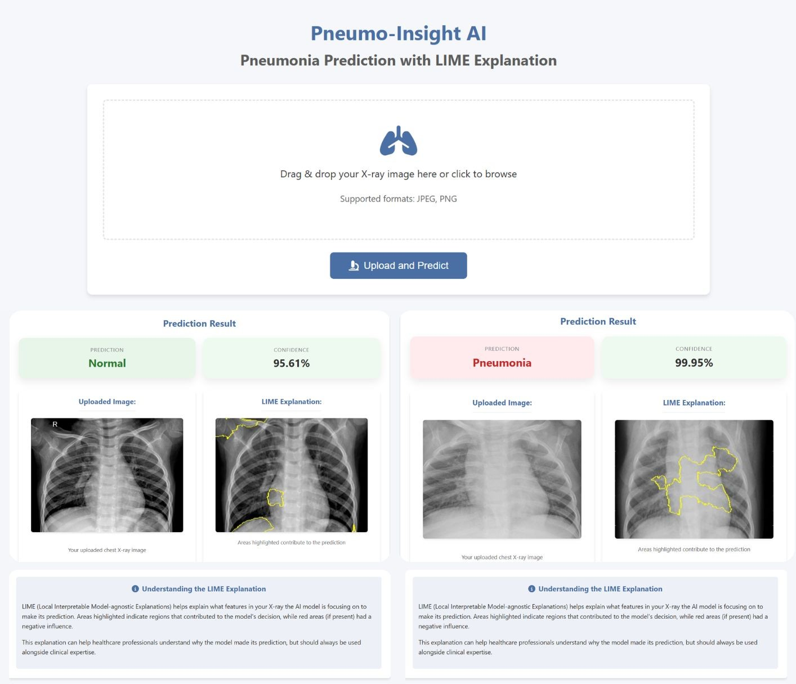

# 🫁 Pneumo-Insight AI

Pneumo-Insight AI is a deep learning-based web application that predicts whether a chest X-ray image indicates **Pneumonia** or **Normal** findings. In addition to classification, the application integrates **LIME (Local Interpretable Model-Agnostic Explanations)** to visually explain which image regions influenced the model’s decision.




## 📌 Features

* Deep learning-powered pneumonia detection
* Explainable AI using LIME
* Interactive Flask web interface
* Drag-and-drop image upload
* Confidence score display
* Enlarged image preview modal
* Automatic cleanup of temporary images

## 🧠 Tech Stack:
🤖 Machine Learning / AI: CNN(VGG19), Tensorflow/Keras , LIME, NumPy, Matplotlib, Scikit-learn    
⚙️ Backend: Flask, Python      
🎨 Frontend: HTML, CSS, JavaScript    

## 📦 Dataset

The dataset used in this project is the [**🔗Chest X-Ray Images (Pneumonia)**](https://www.kaggle.com/datasets/paultimothymooney/chest-xray-pneumonia) dataset from Kaggle.
It contains pediatric chest X-ray images classified into **Normal** and **Pneumonia** categories.   
* Total Images: ~5,863
* Classes: Normal, Pneumonia
* Split: Train, Validation, Test


## 📊 Model Performance

Evaluation on test dataset:

- **Accuracy:** 92.15%  
- **Precision:** Normal: 0.95 | Pneumonia: 0.91  
- **Recall:** Normal: 0.84 | Pneumonia: 0.97  
- **F1 Score:** Normal: 0.89 | Pneumonia: 0.94  

**Confusion Matrix:**

```text
 [[196 38]
 [11 379]]
```


## 📈 Future Improvements

- Multi-class lung disease classification
- Grad-CAM integration
- Mobile-friendly interface
- Cloud deployment
- Performance optimization
- User authentication
- Prediction history dashboard


## Disclaimer

This project is intended for educational and research purposes only and should not replace professional medical diagnosis.